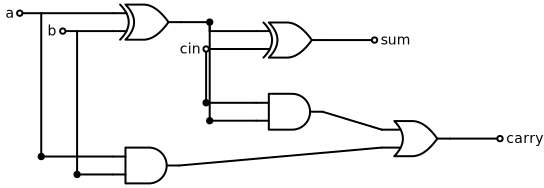

## Why Proofs?

- Complementary to tests
- Harder to cheat on a proof
- A proof can be a small program

## Tests pass for years; a proof finds the bug

`list.sort()` is **Timsort**. For ~9 years it had a bug in its
run-merging logic — undetected by tests.

- **2015:** de Gouw et al. try to *prove* it correct with the KeY
  theorem prover. The proof fails — and points at a broken invariant.
- Only triggers on huge, adversarial inputs → never hit by testing.
- **Python 3.11:** the merge policy is replaced with **Powersort**,
  *proven* near-optimal.

The prover didn't just find the bug — it motivated a better algorithm.

## A bug you can't test away

Binary search picks the middle index:

```java
int mid = (low + high) / 2;   // lived in java.util.Arrays for ~9 years
```

- Two 32-bit indices → **2⁶⁴ ≈ 1.8 × 10¹⁹** input pairs
- At a billion checks per second, exhausting them takes **~585 years**

## z3 finds it — and proves the fix

```python
from z3 import BitVec, ZeroExt, LShR, Implies, And, prove

lo, hi = BitVec("lo", 32), BitVec("hi", 32)
valid = And(lo >= 0, hi >= 0)                        # real array indices
true_mid = LShR(ZeroExt(1, lo) + ZeroExt(1, hi), 1)  # midpoint, no overflow

prove(Implies(valid, true_mid == ZeroExt(1, (lo + hi) / 2)))                  # buggy
prove(Implies(valid, true_mid == ZeroExt(1, (lo & hi) + LShR(lo ^ hi, 1))))   # fixed
```

```text
counterexample
[hi = 1874714396, lo = 2069860050]
proved
```

`lo + hi` overflows to a negative `int` — z3 hands you the exact indices.

## Demo: full adder

A full adder has three Boolean inputs:

- `a`
- `b`
- `cin`

It should return the same result as adding the three bits.

## Full adder circuit

{fig-align="center" width="80%"}

```python
from z3 import Bools, Xor, And, Or, If, prove

a, b, cin = Bools("a b cin")

sum_bit = Xor(Xor(a, b), cin)
carry = Or(And(a, b), And(cin, Xor(a, b)))
```

## Full adder circuit (mermaid) {visibility="hidden"}

```{mermaid}
flowchart LR
    a((a)) --> XOR1[XOR]
    b((b)) --> XOR1
    a --> AND1[AND]
    b --> AND1
    XOR1 --> XOR2[XOR]
    cin((cin)) --> XOR2
    XOR1 --> AND2[AND]
    cin --> AND2
    XOR2 --> sum((sum))
    AND1 --> OR1[OR]
    AND2 --> OR1
    OR1 --> carry((carry))
```

## Full adder specification

```python
total = If(a, 1, 0) + If(b, 1, 0) + If(cin, 1, 0)

prove(If(sum_bit, 1, 0) == total % 2)
prove(If(carry, 1, 0) == total / 2)
```

## What z3 checks

```text
proved
proved
```

The two proof calls mean:

- `sum_bit` is the low bit of `a + b + cin`.
- `carry` is the high bit of `a + b + cin`.

## Why not just exhaustive checks?

$$
\sum_{k=0}^{n-1} (a + kd) = \frac{n(2a + (n - 1)d)}{2}
$$

```python
from sympy import symbols, summation, simplify

a, d = symbols("a d")
n, k = symbols("n k", positive=True, integer=True)

total = summation(a + k * d, (k, 0, n - 1))

assert simplify(total - n * (2 * a + (n - 1) * d) / 2) == 0
```

SymPy proves the general O/A-level formula, not just a list of examples.

## Takeaway

Python can host different styles of proof:

- algebra with SymPy
- circuits and logic with z3
- textbook steps with mathesis or pyzar
